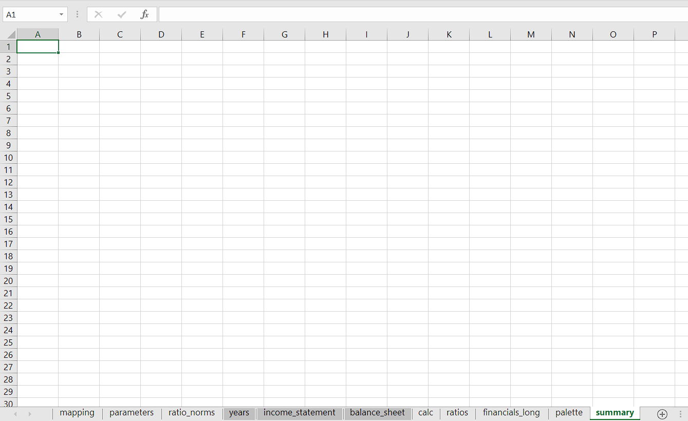
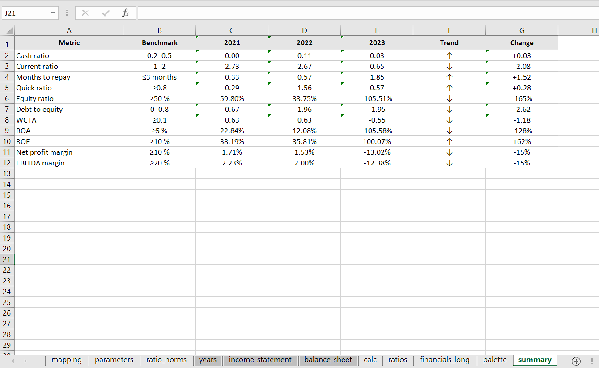
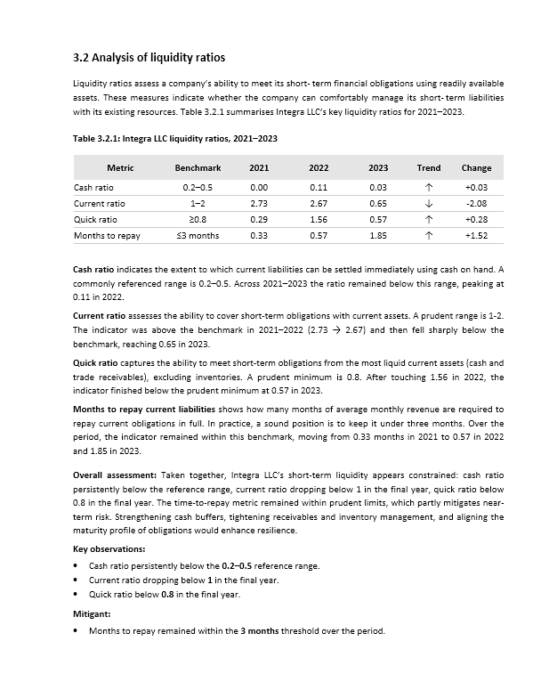
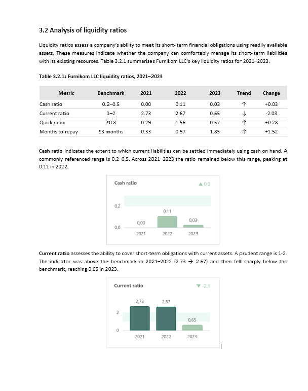
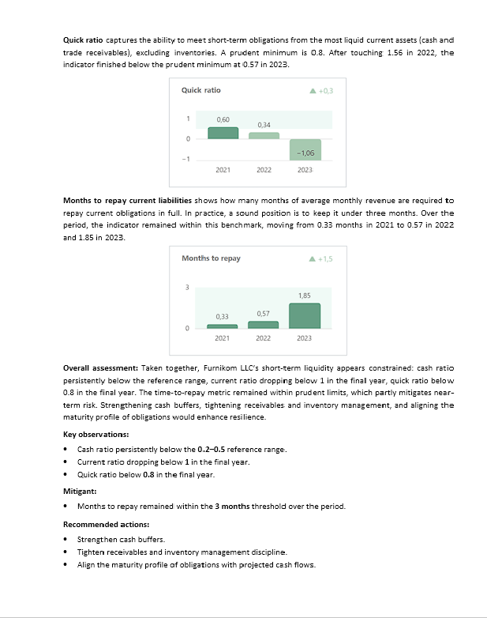

[](https://doi.org/10.5281/zenodo.17979580)

# Financial summary automation (Excel → Word)

An opinionated, production‑style automation for real financial reports. Give it a standard Excel workbook and it will rebuild the **Summary** sheet (twelve core ratios across three years, with norms and deltas) and write a ready‑to‑paste **Word** section for the report — clean table, short narrative, and risk flags. No screenshots, no hand‑tweaking: the same result, every time. This repository shows a small public slice of a deeper client workflow; numbers are anonymised — the method is the point.


**Live page:** https://irinatok11.github.io/fin-health-python/

---

## Table of contents
- [Overview](#overview)
- [Who this is for](#who-this-is-for)
- [Quick start](#quick-start)
- [Key features](#key-features)
- [How it works](#how-it-works)
- [Design decisions](#design-decisions)
- [Methodology](#methodology)
- [Reference articles](#reference-articles)
- [Project structure](#project-structure)
- [Getting started](#getting-started)
- [Input data requirements](#input-data-requirements)
- [Demo: Before → After](#demo-before--after)
- [Formatting and code style](#formatting--code-style)
- [Tests (smoke)](#tests-smoke)
- [Versioning](#versioning)
- [Roadmap](#roadmap)
- [License](#license)
- [Contact](#contact)
---

## Overview

### Scope
- **Excel Summary:** 12 KPIs (across liquidity, financial stability and profitability).
- **Word output:** 4 liquidity KPIs (cash, current, quick, months to repay).

**Two Word variants shown in the demo**
- **v1 — Python only:** Word section exactly as generated by the script (table + narrative).
- **v2 — Python + visuals:** the same Word section **after** manually inserting Power BI charts in the narrative (for portfolio presentation).

**Power BI linkage.** The charts used in **Word v2** are captured from the companion Power BI dashboard  
(**Page 2 — v2, flat/print**) and inserted into the narrative for portfolio presentation.  

Power BI portfolio: **live** https://irinatok11.github.io/fin-health-power-bi/ · **repo** https://github.com/IrinaTok11/fin-health-power-bi/

**Audience.** Executives, finance leads, and analysts who want consistent, low-friction reporting.  
**Tech stack.** Python · pandas · openpyxl · python-docx

---

**Sample workbook:** the repository includes a small example Excel file with the **Summary** sheet already built, so you can see the output at a glance.


## Who this is for
Executive leadership and finance leads; licensed insolvency practitioners (administrators, liquidators, CVA supervisors); and restructuring and turnaround advisers.


## Quick start

```bash
cd run
python -m venv .venv
# Windows:
.venv\Scripts\activate
# macOS/Linux:
source .venv/bin/activate
pip install -r ../requirements.txt
python summary.py
```

Result: the Excel workbook in `run/` gets its **Summary** sheet updated, and the Word file `3.2_analysis_of_liquidity_ratios.docx` appears in `run/`.

---

## Key features
- **One-click pipeline:** Calculates ratios → writes a clean **Summary** sheet (Excel) → creates a **Word** section with title, caption, table, narrative, flags, and recommendations.
- **Norm-aware benchmarks:** Uses `ratio_norms` sheet (“between / higher / lower”, low/high bounds, units) to show proper **Benchmark** text and symbols (≤, ≥, ranges).
- **Trends and deltas:** Adds ↑/↓/→ and the absolute change (**Change**) across the three most recent years.
- **Robust structure checks:** Enforces the presence of required sheets/columns and at least 3 years — reduces human mistakes.
- **Corporate styling by default:** Font (Calibri), paddings, column widths, caption, spacing — no manual polishing needed.
- **Narrative automation:** Generates “Overall assessment”, “Key observations” and “Recommended actions” for the **liquidity subset** (4 KPIs).

---

## How it works
The script **looks for exactly one `.xlsx` in the current working directory**. It reads the required sheets, computes metrics (12 total), builds a **Summary** dataframe, rewrites the Summary sheet, and then saves a Word document named:

```
3.2_analysis_of_liquidity_ratios.docx
```

**Scope note:** Excel **Summary** shows **12 KPIs**. The Word section **3.2** in this repo includes **only 4 liquidity KPIs** (cash, current, quick, months to repay).

> **Tip:** Run it from the `run/` folder so that the Excel is the only `.xlsx` in the working directory.

---

## Design decisions

- **Excel engine.** I use `openpyxl` for read/write because it keeps number formats and conditional styles intact. `xlsxwriter` is brilliant for fresh files, but here I need to **edit** an existing workbook without breaking its look.
- **Word writer.** `python-docx` is sufficient and predictable for a short section with a single table and a few paragraphs; no templating engine is required, which makes the output deterministic.
- **Sheet and column matching.** Sheet names and headers are matched in a **case/space‑insensitive** way (so `Summary`, `summary`, or `Summary ` all resolve to the same target). This reduces edge‑case failures when the source file comes from different accountants.
- **Norms as data, not prose.** Benchmarks live in `ratio_norms` (with `better_is` and numeric bounds). The narrative then **reads** these values and decides the wording (≤, ≥ or ranges) instead of hard‑coding phrases.
- **Percentages as numbers.** All percentage outputs remain numeric with an Excel `number_format` rather than pre‑formatted strings, so downstream tooling can still aggregate and chart.
- **Single source file.** The pipeline expects **one** workbook in `run/`. That constraint keeps the CLI simple and avoids accidental cross‑contamination.

## Methodology

A concise, practitioner‑focused write‑up of the pipeline is published in HTML:

- **Website:** https://irinatok11.github.io/fin-health-python/methodology.html  
- **Repo file:** [docs/methodology.html](docs/methodology.html)

It covers the architecture and data flow, concrete outputs (Excel **Summary** + Word section “3.2 Analysis of liquidity ratios”), the business questions we answer, layout choices, operational constraints, and a short reproducibility checklist.

## Reference articles

Supporting notes used across the project:

- **Architecture (high‑level):** [docs/reference/architecture.md](docs/reference/architecture.md)
- **KPI catalogue:** [docs/reference/kpi_catalog.md](docs/reference/kpi_catalog.md)
- **Case study — Liquidity reporting in practice:** [docs/reference/case_study.md](docs/reference/case_study.md)

## Project structure

```
fin-health-python/
├─ run/                             # working folder (run the script here)
│  ├─ summary.py
│  ├─ integra_financial_analysis.xlsx
│  ├─ 3.2_analysis_of_liquidity_ratios.docx   # appears after running
│  └─ README.md
├─ docs/                            # GitHub Pages (live site content)
│  ├─ _config.yml                   
├─ index.html                       # Landing page for the Python portfolio case
├─ methodology.html                 # Methodology and reproducibility details
├─ reference/                       # Lightweight reference notes (Markdown)
│  ├─ architecture.md               # System architecture / data flow overview
│  ├─ kpi_catalog.md                # KPI catalogue (rules, norms, tests)
│  └─ case_study.md                 # Short case narrative
└─ assets/
   ├─ css/
   │  └─ portfolio.css              # Global styles; hides nav links on ≤640px (logo only)
   ├─ 00_summary_before.png         # Screenshots are stored at the root of /assets
   ├─ 01_summary_after.png
   ├─ 02_word_v1_page1.png
   ├─ 03_word_v1_page2.png
   ├─ 04_word_v2_page1.png
   └─ 05_word_v2_page2.png
├─ demo/
│  └─ README.md                     # how to capture real screenshots
├─ .gitignore
├─ requirements.txt
├─ LICENSE
└─ README.md                        # this file
```

---

## Getting started

1. **Create and activate a virtual environment**
   ```bash
   python -m venv .venv
   # Windows:
   .venv\Scripts\activate
   # macOS/Linux:
   source .venv/bin/activate
   ```

2. **Install dependencies**
   ```bash
   pip install -r requirements.txt
   ```

3. **Run from the `run/` directory**
   ```bash
   cd run
   python summary.py
   ```

4. **Check the results**
   - The Excel workbook in `run/` now has an updated, formatted **Summary** sheet.
   - A Word file `3.2_analysis_of_liquidity_ratios.docx` appears in `run/`.

> If you use a different workbook, place it into `run/` and ensure it is the **only** `.xlsx` there when running the script.

---

## Input data requirements

**Sheets expected (case-insensitive; underscores/spaces are normalized):**
- `years`: first column contains the years (e.g., 2021, 2022, 2023). **At least 3 years** are required.
- `parameters`: two columns — `Parameter`, `Value` (may include `company_name`).
- `income_statement`: must include a `Variable` column and year columns (e.g., `2021`, `2022`, `2023`).
- `balance_sheet`: same requirements as `income_statement`.
- `ratio_norms`: columns — `ratio_key`, `better_is` (`between|higher|lower`), optional `norm_low`, `norm_high`, and `unit`.

**Ratios computed (12): Cash ratio, Current ratio, Quick ratio, Months to repay, Equity ratio, Debt-to-equity, Working capital, ROA, ROE, Net profit margin, EBITDA margin, Altman index.

---

## Demo: Before → After

> **Visuals policy:** Power BI visuals are **not** stored in this repo.

### Summary — before → after
| Summary — before | Summary — after (generated) |
|---|---|
|  |  |

### Option 1 — Word (v1, Python only)
| Page 1 | Page 2 |
|---|---|
|  |  |

### Option 2 — Word (v2, Python + Power BI visuals)
For portfolio presentation, **Word v2** is the **same section** after manually inserting charts captured from the companion **Power BI dashboard (Page 2 — v2, flat/print)** — same numbers, different presentation.  
Power BI: **live** — [irinatok11.github.io/fin-health-power-bi](https://irinatok11.github.io/fin-health-power-bi/) · **repo** — [github.com/IrinaTok11/fin-health-power-bi](https://github.com/IrinaTok11/fin-health-power-bi)

| Page 1 | Page 2 |
|---|---|
|  |  |

---

## Formatting and code style

This is a small production script, so I keep the toolchain light. If you want the same formatting I use:

```bash
# Optional, but recommended
pip install black ruff

# Format
black .

# Lint (fast default rule set)
ruff check .
```

## Tests (smoke)

A tiny “does it run” test is often enough for a utility like this. The suggested structure:

```
tests/
└─ test_smoke.py
```

And a minimal test body (pseudo‑code):

```python
from pathlib import Path
from run.summary import main  # or similar entry point

def test_smoke(tmp_path: Path):
    # Copy demo workbook into a temp run/
    # Call the pipeline
    # Assert that Summary sheet was rebuilt and a Word file appeared
    assert (tmp_path / "3.2_analysis_of_liquidity_ratios.docx").exists()
```

## Versioning

Single‑file utility, semantic-ish versioning in the header:

```python
__author__ = "Irina Tokmianina"
__version__ = "0.1.0"
```
I bump the **minor** when outputs change shape; the **patch** when wording/formatting is tweaked.

## Roadmap
- [ ] Configurable output directory (not only CWD).
- [ ] Optional CSV export of Summary.
- [ ] CLI flags (e.g., `--excel PATH`, `--company NAME`, `--no-word`).
- [ ] Unit tests and CI smoke checks.

---

## License
This project is available under the **MIT License**. See [LICENSE](LICENSE).

---

## Contact
**IRINA TOKMIANINA** — Financial/BI Analyst  
LinkedIn: [linkedin.com/in/tokmianina](https://www.linkedin.com/in/tokmianina/) · Email: <irinatokmianina@gmail.com>

